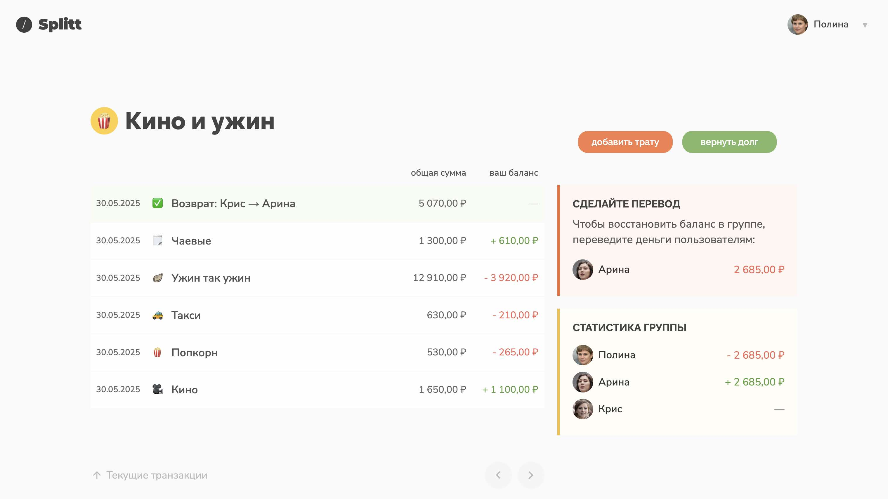
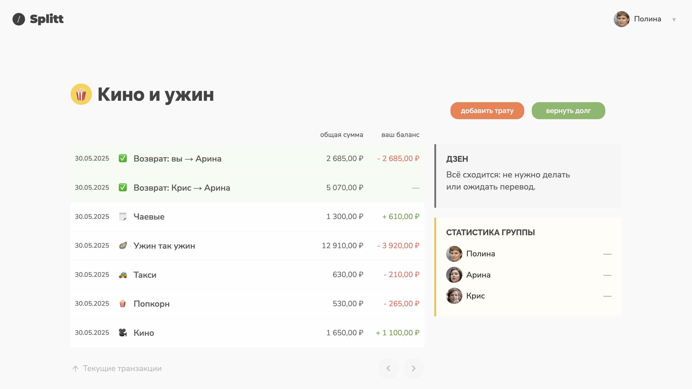
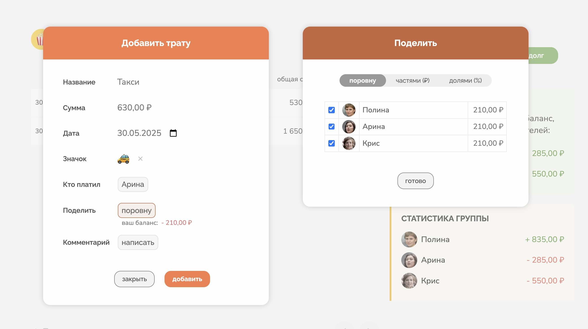
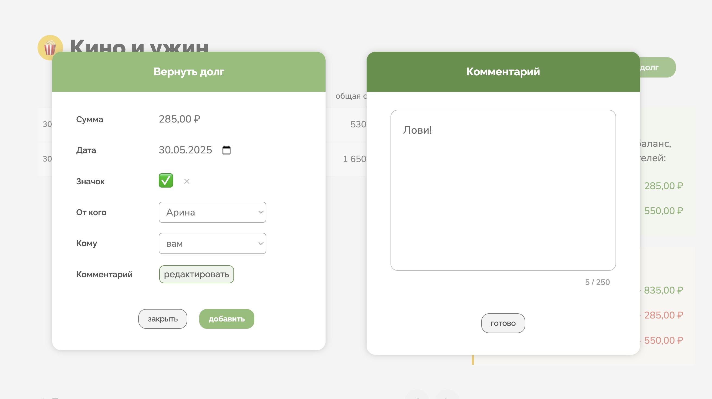

# Splitt Frontend

Прототип клиентской части приложения Splitt — сервиса, помогающего пользователям делить расходы внутри группы. Здесь можно добавлять траты, возвращать долги и смотреть, кто кому сколько должен.

## Демонстрация

Подробнее изучить основные функции приложения можно в видео-демонстрации (видео без звука): 
* [Яндекс.Диск](https://disk.yandex.ru/i/yFO4UJSWBW-a9w) 
* [Vimeo](https://vimeo.com/1089496466/d01010520f)

Версия проекта из видео-демонстрации выложена на отдельном сайте: [splitt-demo-v01.netlify.app](https://splitt-demo-v01.netlify.app/).  
На сайте можно посмотреть, как происходят расчеты в основных формах: «Добавить трату» и «Вернуть долг».

Серверная часть приложения: [Splitt Backend](https://github.com/max-vassiliev/splitt-backend).

## Технологии

* HTML
* CSS
* JavaScript

## Процесс

Этот проект — моя первая попытка самостоятельно разработать веб-интерфейс от идеи и поиска референсов до полной реализации. 

Сначала я создал макет интерфейса, затем сверстал его на HTML и CSS. На первом этапе логика страницы была реализована в одном JS-файле, но по мере роста проекта возникла необходимость структурировать код. Я внедрил архитектурный шаблон MVC: выделил представление, бизнес-логику и слой состояния. Это позволило проще настраивать взаимодействие с backend и упростило поддержку кода.

## Задачи по проекту

* Разработка интерфейса для десктоп-версии
* Базовая верстка
* Реализация интерактивности на чистом JavaScript
* Настройка взаимодействия с бэкендом через Fetch API
* Интеграция библиотеки [emoji-mart](https://github.com/missive/emoji-mart) для удобного выбора эмодзи

## Функциональность

### Страница группы

Главная «рабочая» страница приложения. 

Здесь отображается список последних транзакций в группе, статус текущего пользователя, а также статистика всех участников группы. С помощью кнопок «Добавить трату» и «Вернуть долг» можно открыть соответствующие формы. 

### Форма «Добавить трату»

При добавлении траты необходимо указать ее название и сумму. По умолчанию трата будет записана на текущего пользователя и равномерно распределена между всеми членами группы. 

Поменять плательщика можно в подформе «Кто платил». 

В подформе «Поделить» можно выбрать способ деления: 
1. поровну — трата равномерно распределится между отмеченными пользователями;
2. частями — нужно указать точную сумму для каждого пользователя;
3. долями — распределить в процентном соотношении.

Под кнопкой «Поделить» отображается баланс текущего пользователя в рамках этой траты. Баланс меняется при вводе суммы траты, а также при изменениях в подформах «Кто платил» и «Поделить». 

Дополнительно можно поменять значок, дату и добавить комментарий.

### Форма «Вернуть долг»

При добавлении возврата нужно указать сумму и пользователей — кто возвращает и кто получает. По умолчанию плательщиком указан текущий пользователь. Дополнительно можно поменять значок, дату и добавить комментарий.

## Автор

Максим Васильев ([GitHub](https://github.com/max-vassiliev))

